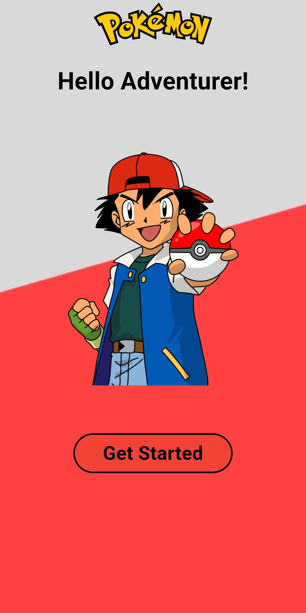
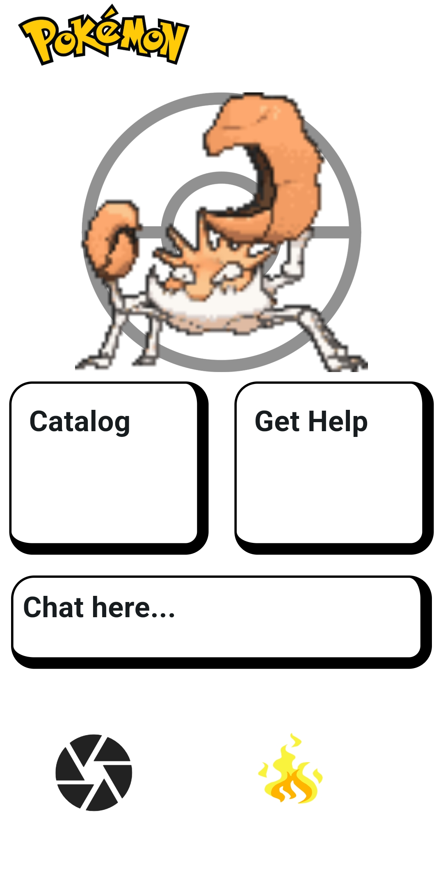
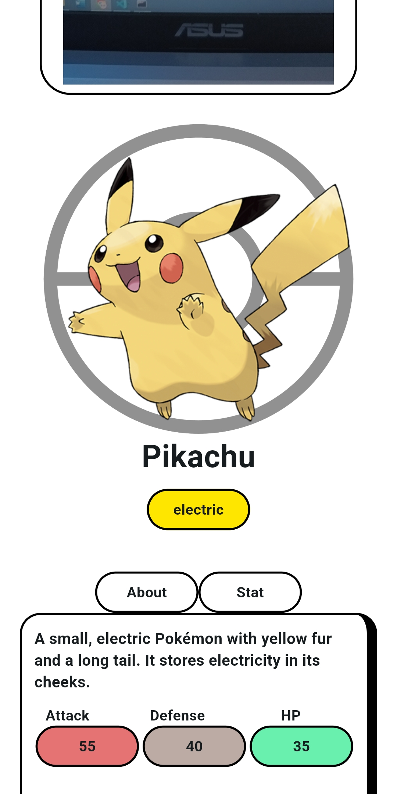

# Pokedex2.0

**Pokédex Pro: Your Ultimate Pokémon Companion** Welcome to **Pokédex Pro**, the perfect app for Pokémon enthusiasts! Whether you’re a seasoned trainer or just starting your journey, this app is your one-stop shop for all things Pokémon. Here's what it offers:  

### **Features:** 1. **Extensive Pokémon Catalog** - Explore a beautifully designed catalog featuring detailed profiles of **150 Pokémon**.  
   - Learn about their types, abilities, evolution stages, and Pokédex entries.  
   - High-resolution images and animated sprites bring each Pokémon to life.  

2. **AI Pokémon Classifier**
   - Integrated an image classification model to identify **50 different Pokémon**.
   - Simply scan a Pokémon, and the app will tell you who it is!
   - After a successful detection, the app instantly displays that Pokémon's stats.

3. **Help Page** - Confused about how to use the app?  
   - Visit the **Help Page** for simple guides, FAQs, and useful tips on navigating your Pokédex Pro experience.  

4. **Gemini Chat Bot** - A friendly AI-powered chatbot that lets you chat about Pokémon!  
   - Ask for trivia, get tips for battles, or have fun conversations about your favorite Pokémon.  

5. **Fire Animated Button** - A fiery button blazing with animation at the bottom of your screen.  
   - Tap it to summon a **random Pokémon**, complete with a witty or funny **joke text** tailored to its personality or traits!  
   - Example: "Charizard appeared! Why doesn’t Charizard ever play hide and seek? Because he always *blazes* his trail!"  

  
<h3>Splash screen</h3>

 

<h3>home page</h3>
  

  
<h3>Classification</h3>

 

  

**Why You'll Love Pokédex Pro** This app combines knowledge, fun, and interactive features in a sleek, user-friendly design. Whether you're a casual fan or a hardcore trainer, Pokédex Pro is your perfect partner for everything Pokémon!